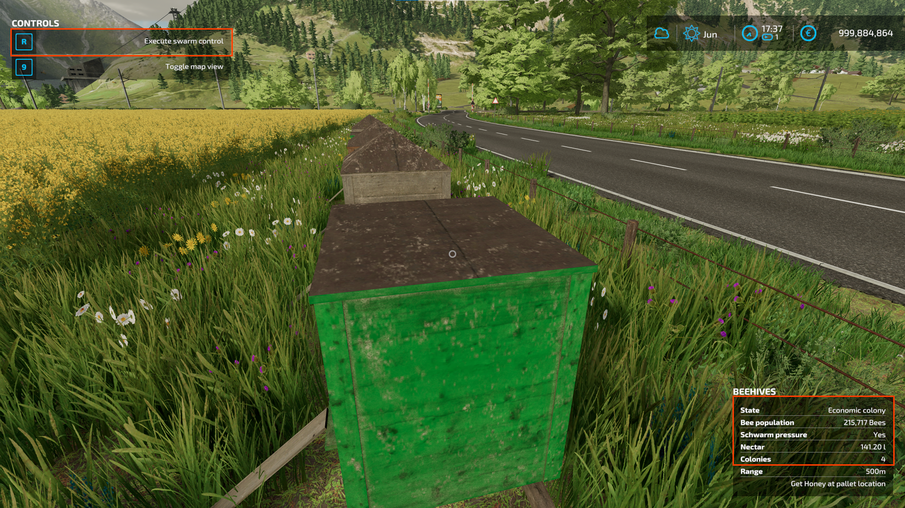
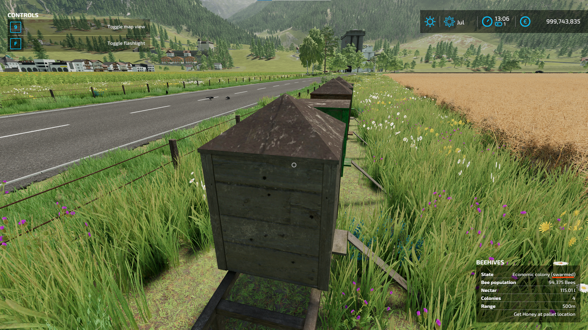
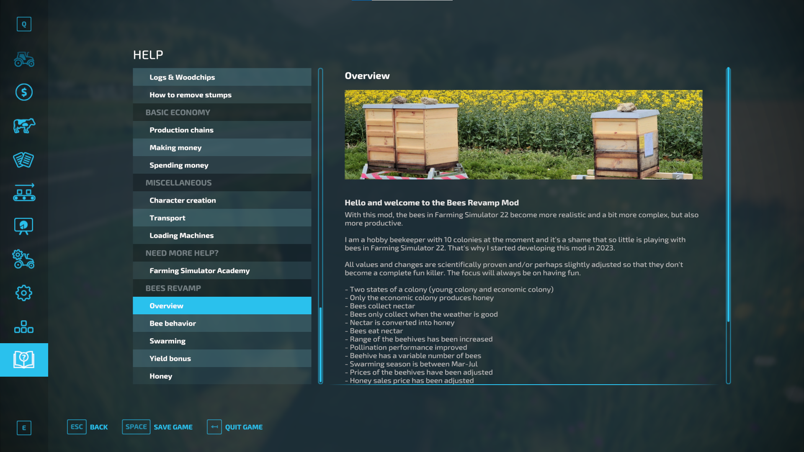
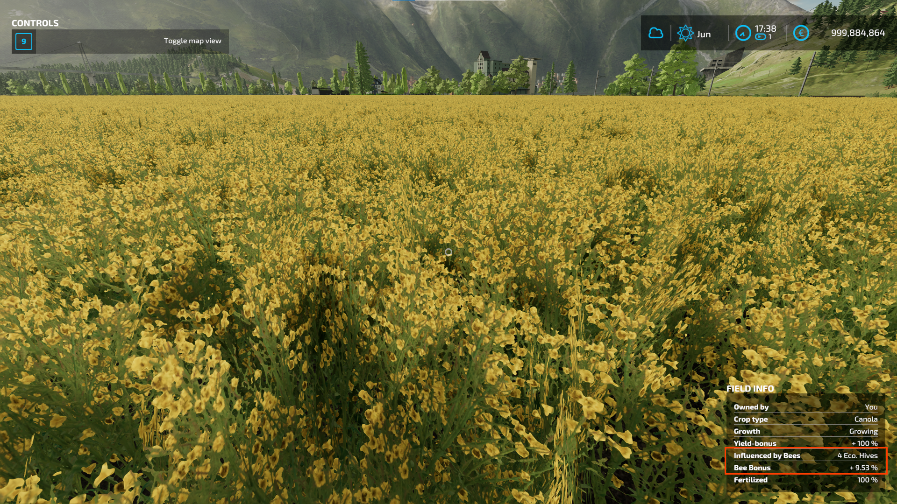
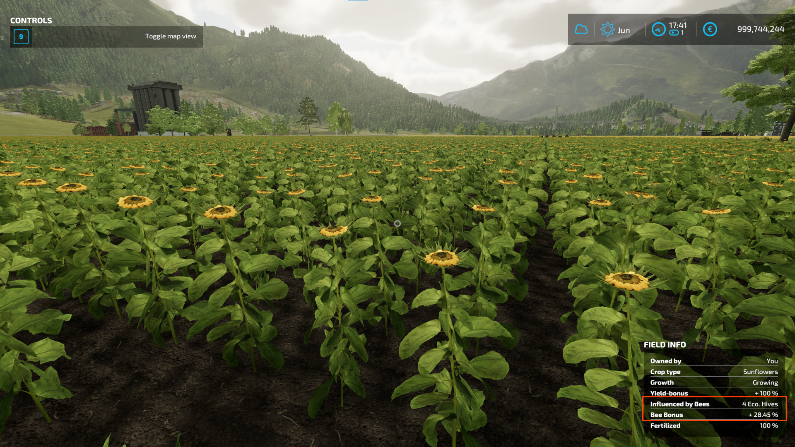
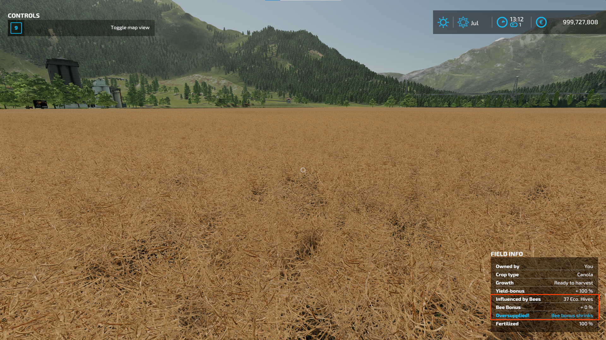

<a name="readme-top"></a>

<div align="center">

[](https://www.farming-simulator.com/)
[](https://www.farming-simulator.com/mod.php?mod_id=298737)
[](https://github.com/Peppie84/FS22_BeesRevamp/issues)
[](https://www.gnu.org/licenses/gpl-3.0)
[](https://github.com/Peppie84/FS22_BeesRevamp/commits/development)
[](https://github.com/search?q=repo%3APeppie84%FS22_BeesRevamp++language%3ALua&type=code)


<h3 align="center"><u>FS22_BeesRevamp</u></h3>

<p align="center">
    With this mod, bees in Farming Simulator 22 become more realistic and a bit more complex but also more productive.<br />
    All values and changes are scientifically proven and/or perhaps slightly adjusted so that they do not completely kill the fun of the game. The focus will always be on having fun.<br />
    Most questions can be answered by the in-game help of this mod.
</p>

</div>

<div align='center'>
    
    
    <br />
    
    
    <br />
    
    
    <br />
</div>

## Features
- Two states of a colony (young colony and economic colony)
- Only the economic colony produces honey
- Bees collect nectar
- Bees only collect when the weather is good
- Nectar is converted into honey
- Bees eat nectar
- Range of the beehives has been increased
- Pollination performance improved
- Beehive has a variable number of bees
- Swarming season is between Mar-Jul
- Prices of the beehives have been adjusted
- Honey sales price has been adjusted
- Precision farming compatible
- TerraLife compatible


## Current development:
See TODO.md

---

## Current Beehivesystem
The beehivesystem class is the main controller for all beehives. It controls the flying bee animation (fx) and also the honey production.

### Honey production
| |Honey per Period|Honey per Hour|Placeable Price|
|---|:---:|:---:|:---:|
| BeeHive LVL1 | 5 | 0.2083¯ | 1100 |
| BeeHive LVL2 | 20 | 0.8333¯ | 4400 |
| BeeHive LVL3 | 25 | 1.0416¯ | 6600 |
| BeeHive LVL4 | 150 | 6.25 | 12500 |
| BeeHive LVL5 | 495 | 20.625 | 19000 |

### Beehive behavior

| |Flying bees fx|Honey production (every hour)|
|---|:---:|:---:|
| SunIsOn | x | x (HoneyPerHour * reciprocal(DaysPerPeriod)) |
| IsRaining | - | x (HoneyPerHour * reciprocal(DaysPerPeriod)) |
| IsWinterPeriod | - | - |

---

 ## New Behivesystem
 ### Honey production
It's hard to re-calculate a new value for real bees. In real, a bee hive with two brood boxes + one honey box can produce 50kg per year (spring and summer) - in average, or also 90kg just on a canola field in spring, depending on the weather. But a two boxes brood hive also needs nearly 15kg food for winter (Nov-Feb/Mar), mostly feeded with sugar water or something similar.

Below you can see some "real" numbers for the placables and situations.
Based on the average of 50kg per year and 8 month of production + 2 days per month as season settings:

`50kg/year / 8 = 6.25 kg/month / reciprocal(2) = 3.125 kg/day / 24 = 0.13020833¯ kg/hour`

For a single box hive, the defined `Beehive groth factor` simulates the growing/shrinking of a hive. So, a single box hive can produce `0.26041666 kg/hour` instead of its `0.13020833¯ kg/hour` on month **Jun**.

 | Season |Honey per Period|Honey per Hour|Placeable Price|
|---|:---:|:---:|:---:|
| BeeHive LVL1 | 6.25 | 0.260416¯ | 200 |
| BeeHive LVL2 | 11.25 | 0.46875 | 400 |
| BeeHive LVL3 | 12.25 | 0.5104166¯ | 450 |
| BeeHive LVL4 | 73.0 | 3.04166¯ | 2500 |
| BeeHive LVL5 | 240.9 | 10.0375 | 8500 |

### Beehive growth factor

 | | Period |Factor|
|---|---|:---:|
| Spring | Mar | 0.75 |
| Spring | Apr | 1.50 |
| Spring | May | 2.25 |
| Summer | Jun | 3.20 |
| Summer | Jul | 2.80 |
| Summer | Aug | 2.00 |
| Fall | Sep | 1.50 |
| Fall | Oct | 0.75 |
| Fall | Nov | -0.50 |
| Winter | Dec | -0.50 |
| Winter | Jan | -0.50 |
| Winter | Feb | -0.50 |

### Beehive behavior

| |Flying bees fx|Honey production (every hour)|
|---|:---:|:---:|
| SunIsOn | x | x (HoneyPerHour * reciprocal(DaysPerPeriod)) * BeehiveGrowthFactor |
| Is under 10°C | - | x (HoneyPerHour * reciprocal(DaysPerPeriod)) * BeehiveGrowthFactor |
| IsRaining | - | x (HoneyPerHour * reciprocal(DaysPerPeriod)) * BeehiveGrowthFactor |
| IsWinterPeriod | - | x (HoneyPerHour * reciprocal(DaysPerPeriod)) * BeehiveGrowthFactor |


# Helps
- Accessing global to the beehive system:
```
g_currentMission.beehiveSystem
```


# Devs
## Spezialisierungen

### PlaceableBeehiveExtended
Placable related functions.
Registered methods:
 - **getBeehiveHiveCount()**<br />
 Get the current beehive count for this placeable
 - **updateActionRadius(number)**<br />
 Set the flying radius to a new value. Currently set to 500. Basegame ~150
 - **updateNectar(number)**<br />
 Update the current nectar value by the given number of nectar in liter.
 - **updateNectarInfoTable()**<br />
 Refreshs the nectar info text for the placeable

### BeeCare
In der BeeCare Spezialisierung geht um das Wohl der Bienen. Hier wird gesteuert ob Schwarmkontrolle gemacht werden muss, die Aktion wird hier gesteuert, die Winterbehandlung, die Anzahl der Binen pro Volk (Hive).
Registrierte Methoden:
 - getBeePopulation
 - updateInfoTables
 - getCanInteract
 - doSwarmControl
 - getSwarmControleNeeded

## Manager

### BeehiveSystemExtended

# Copyright
Copyright (c) 2023-2024 [Dennis Schmitt](https://github.com/peppie84).
All rights reserved.

<p align="right">(<a href="#readme-top">back to top</a>)</p>